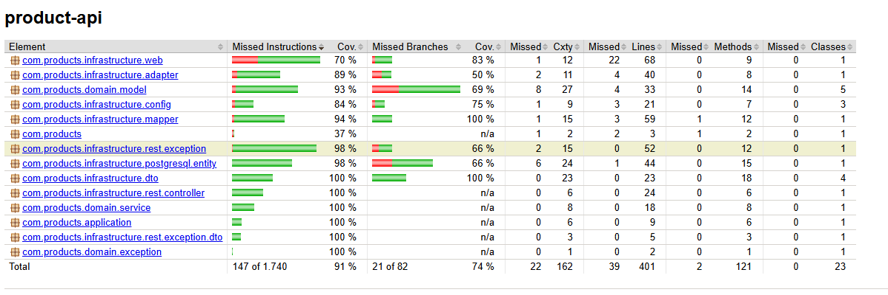
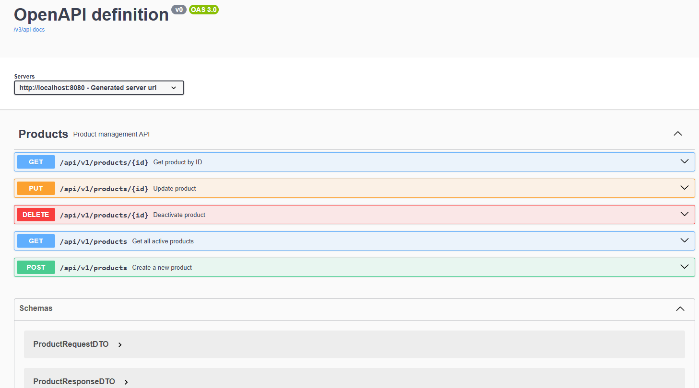

# Products API - Spring Boot Application

This is a Spring Boot application for managing products with a REST API and web interface.

### Development/Local (PostgreSQL Docker)

```bash
# 1. Start PostgreSQL database
docker-compose up -d postgres

# 2. Compile and run application (connects to local PostgreSQL)
mvn spring-boot:run

# 3. Access the application:
# - REST API: http://localhost:8080/api/products
# - Web Interface: http://localhost:8080/products
```

⚠️ **Note**: The application connects to **local PostgreSQL database** via Docker. Docker is required for development.

## Database Configuration

### PostgreSQL Local (Default - Docker)
The application connects to **local PostgreSQL database** automatically using Docker Compose.

**Database Details:**
- **Database**: products_db
- **User**: products_user
- **Password**: products_pass
- **Port**: 5432 (localhost)

### Test Configuration
Tests use the same PostgreSQL configuration but with `create-drop` mode for clean test runs.

## API Endpoints

### REST API (JSON)
- `GET /api/products` - Get all products with pagination
- `GET /api/products/{id}` - Get product by ID
- `POST /api/products` - Create new product
- `PUT /api/products/{id}` - Update product
- `DELETE /api/products/{id}` - Delete product

### Web Interface (HTML)
- `GET /products` - View all products
- `GET /products/new` - Create new product form
- `GET /products/{id}` - View product details
- `GET /products/{id}/edit` - Edit product form

## Testing

```bash
# Run all tests
mvn test

# Run integration tests
mvn integration-test

# Run tests with coverage
mvn jacoco:prepare-agent test jacoco:report
```

## Build and Package

```bash
# Build JAR
mvn clean package

# Build and run
mvn clean package && java -jar target/product-api-*.jar
```

## Environment Summary

| **Environment** | **Database** | **Docker Required** |
|-----------------|--------------|---------------------|
| **Development** | PostgreSQL Local | ✅ Yes |
| **Testing** | PostgreSQL Local | ✅ Yes |

## 🗄️ Database Setup

### Docker PostgreSQL (Only for Integration Tests)
Docker Compose is **only needed for integration tests**, not for development:

```bash
# Only required when running integration tests
docker compose up -d
mvn integration-test
```

## 🧪 Tests

### Unit Tests (No Docker required)
```bash
mvn test
```

### Integration Tests (Requires Docker)
```bash
# 1. Start test database
docker compose up -d

# 2. Run integration tests
mvn integration-test

# 3. Run all tests
mvn verify
```

## 🔍 Coverage: 91%
The coverage report will be available at: `/target/coverage-reports/aggregate/index.html`



## 📱 Access

- **REST API**: http://localhost:8080/api/v1/products


- **Documentation**: http://localhost:8080/swagger-ui.html



## 🛠️ Technologies

- Java 21 + Spring Boot 3.2.0
- Spring Web
- Spring Data JPA
- Spring Validation
- PostgreSQL + Docker
- Maven + JUnit 5 + Mockito + jaCoCo
- Cucumber + gherkin


## 📋 Endpoints

| Method | URL | Description                      |
|--------|----|----------------------------------|
| `GET` | `/api/v1/products` | Product list               |
| `GET` | `/api/v1/products?page=0&size=10&sort=id,asc` | Product list with pagination |
| `GET` | `/api/v1/products/{id}` | Get product                 |
| `POST` | `/api/v1/products` | Create product                   |
| `PUT` | `/api/v1/products/{id}` | Update product              |
| `DELETE` | `/api/v1/products/{id}` | Delete product                |


### 🔄 **Future Improvements**
If I had more time I would implement:

1. **Security**
   - OAuth + JWT     

2. **Observability**
   - Metrics with Micrometer/Prometheus   

3. **Testing**
   - More use cases in integration tests 

4. **Code Quality**
   - I would implement SonarQube
   - Security test with OWASP ZAP

5. **Logging**
   - Add more log levels properly (INFO, WARN, ERROR, DEBUG)
   
## 👨‍💻 Technical Decisions

### Hexagonal Architecture
I chose this architecture to:
- Decouple business logic from infrastructure
- Facilitate testing with mocks and stubs
- Allow technology changes without affecting the core
- Follow DDD and Clean Architecture principles

### Testing Strategy
- **Test Pyramid**: Wide base of unit tests, selective integration tests
- **BDD with Cucumber**: Executable documentation for stakeholders
- **Separation of Concerns**: Well-defined unit vs integration tests

### Database
- **Optimized PostgreSQL**: Efficient queries with strategic indexes

### Soft Delete
I implemented deactivation instead of physical deletion to:
- Maintain referential integrity


## 📝 Notes

This project demonstrates:
- **Testing Excellence**: 91% coverage with comprehensive strategy
- **Clean Architecture**: SOLID principles, DDD and Hexagonal Architecture
- **Optimized Performance**: Efficient queries with strategic indexes
- **Enterprise Quality**: Maintainable, documented and well-structured code
- **DevOps Ready**: Automated tests, coverage reports, containerization
- **Scalability**: Design prepared for growth and distribution